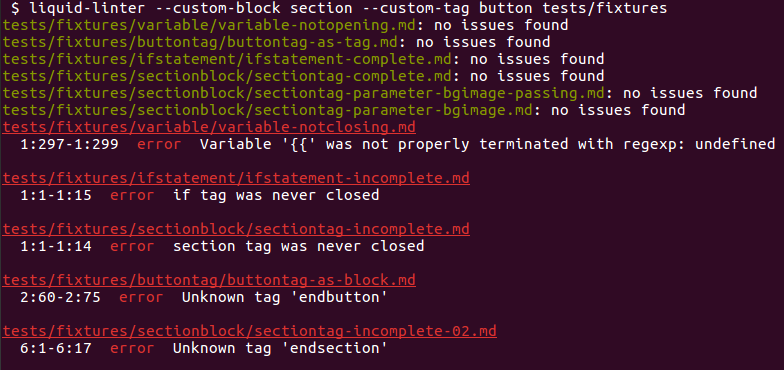

# Liquid Linter CLI

![Project Stage][project-stage-shield]
![Maintenance][maintenance-shield]
![Awesome][awesome-shield]
[![License][license-shield]](LICENSE.md)
[![Dependency Status][dependency-status]][librariesio]
[![Latest Version on NPM][version-shield]][version]


> _“Great things are done by a series of small things brought together.”_
> ~ Vincent Van Gogh

This package is a wrapper for the NodeJs [liquid-linter][liquid-linter] package,
allowing it to be run from the command-line interface (CLI).

## Installation

Install this package with [NPM][NPM] using `npm install liquid-linter-cli --save`
(optionally adding `--global` for a system-wide install) or with [Yarn][Yarn]
using `yarn add liquid-linter-cli` (or `yarn global add liquid-linter-cli` for a
system-wide install).

## Usage

The lint command can be called with one or more paths of files or folders that
need to be linted. The command has support for [pipelines][pipelines]. when
given a directory, it is scanned for the following file extensions:

- `.htm`
- `.html`
- `.liquid`
- `.lqd`
- `.markdown`
- `.md`

Currently the linter does not have a way to _exclude_ files or folders. An
example of how to achieve this is given in the "Pipes" section.

### Simple usage

The most simple use is simply:

```bash
liquid-linter /path/to/directory/or/file/to/lint
```

### Multiple sources

The lint command has support for multiple paths. This can be a mix of files and
folders:

```bash
liquid-linter /path/to/directory/one /path/to/file /path/to/directory/two
```

### Custom blocks and tags

Liquid has support for custom [tags][liquid-tags]. The liquid-linter makes the
distinction between **tags** (tags that _do not_ require an end tag) and
**blocks** (tags that _do_ require an end tag).

Custom tags and blocks can be passed to the linter using the `--custom-tag` and
`--custom-block` flags, respectively. Both can be added multiple times, to add
more than one tag or block:

```bash
liquid-linter --custom-block section --custom-tag button --custom-tag color /path/to/directory
```

### Piping

In order to _exclude_ files and folder, the user has to create a list themselves
which does not contain the files and/or folders that should be excluded.

One way to achieve this is by using a combination of [`find`][gnu-find] and [`xargs`][gnu-xargs].

The following example shows how to lint all files and folders in the current
directory except the `node_modules` and `_site` folders, and only for files with
the `.lqd` extension (commonly used for [includes][includes])

```bash
find . -type f -name "*.lqd"     \
  -not -path './node_modules/*'  \
  -not -path './_site/*' -print0 \
| xargs -0 -n1 liquid-linter
```

### Output

The output of the linter displays a list of files and the result of the linting
of that file. Files with no issues are colored green, files with issues are
colored red.

For files with issues, the line and column(s) at which the error occurred are
show.

#### Example



The output is taken _directly_ from [liquid-linter]. Any weird output or
incorrect linting should be reported at the [liquid-lint repository].

## Contributing

This is an active open-source project. We are always open to people who want to
use the code or contribute to it.

We've set up a separate document for our [contribution guidelines][contribution-guidelines].

Thank you for being involved! :heart_eyes:

## Authors & contributors

The original idea and setup of this repository is by [Potherca][potherca].

For a full list off all author and/or contributors, check [the contributors page][contributors].

## License

- The logo for this project is the "Staple Remover" icon by
  [Cassie McKown][Cassie McKown] from [the Noun Project][the Noun Project]

- The code in this project is licensed under the MIT License

> The MIT License (MIT)
>
> Copyright (c) 2017 Dealerdirect B.V. <br>
> Copyright (c) 2019 Potherca
>
> Permission is hereby granted, free of charge, to any person obtaining a copy
> of this software and associated documentation files (the "Software"), to deal
> in the Software without restriction, including without limitation the rights
> to use, copy, modify, merge, publish, distribute, sublicense, and/or sell
> copies of the Software, and to permit persons to whom the Software is
> furnished to do so, subject to the following conditions:
>
> The above copyright notice and this permission notice shall be included in
> all copies or substantial portions of the Software.
>
> THE SOFTWARE IS PROVIDED "AS IS", WITHOUT WARRANTY OF ANY KIND, EXPRESS OR
> IMPLIED, INCLUDING BUT NOT LIMITED TO THE WARRANTIES OF MERCHANTABILITY,
> FITNESS FOR A PARTICULAR PURPOSE AND NONINFRINGEMENT.  IN NO EVENT SHALL THE
> AUTHORS OR COPYRIGHT HOLDERS BE LIABLE FOR ANY CLAIM, DAMAGES OR OTHER
> LIABILITY, WHETHER IN AN ACTION OF CONTRACT, TORT OR OTHERWISE, ARISING FROM,
> OUT OF OR IN CONNECTION WITH THE SOFTWARE OR THE USE OR OTHER DEALINGS IN
> THE SOFTWARE.

[awesome-shield]: https://img.shields.io/badge/awesome%3F-yes-brightgreen.svg
[Cassie McKown]: https://thenounproject.com/mckowncr/
[contribution-guidelines]: CONTRIBUTING.md
[contributors]: https://github.com/potherca/liquid-linter-cli/graphs/contributors
[dependency-status]: https://img.shields.io/librariesio/release/npm/liquid-linter-cli.svg
[gnu-find]: https://www.gnu.org/software/findutils/manual/html_mono/find.html#Top
[gnu-xargs]: https://www.gnu.org/software/findutils/manual/html_mono/find.html#Invoking-xargs
[includes]: https://help.shopify.com/themes/liquid/tags/theme-tags#include
[librariesio]: https://libraries.io/npm/liquid-linter-cli
[license-shield]: https://img.shields.io/github/license/potherca/liquid-linter-cli.svg
[liquid-lint repository]: https://github.com/tomheller/liquid-linter/issues
[liquid-linter]: https://www.npmjs.com/package/liquid-linter
[liquid-tags]: https://help.shopify.com/themes/liquid/tags
[maintenance-shield]: https://img.shields.io/maintenance/yes/2019.svg
[NPM]: https://www.npmjs.com/
[pipelines]: https://en.wikipedia.org/wiki/Pipeline_(Unix)
[potherca]: https://pother.ca/
[project-stage-shield]: https://img.shields.io/badge/Project%20Stage-Development-yellowgreen.svg
[the Noun Project]: https://thenounproject.com/
[version-shield]: https://img.shields.io/npm/v/liquid-linter-cli.svg
[version]: https://www.npmjs.com/package/liquid-linter-cli
[Yarn]: https://yarnpkg.com/


